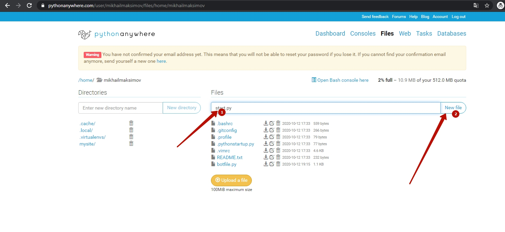
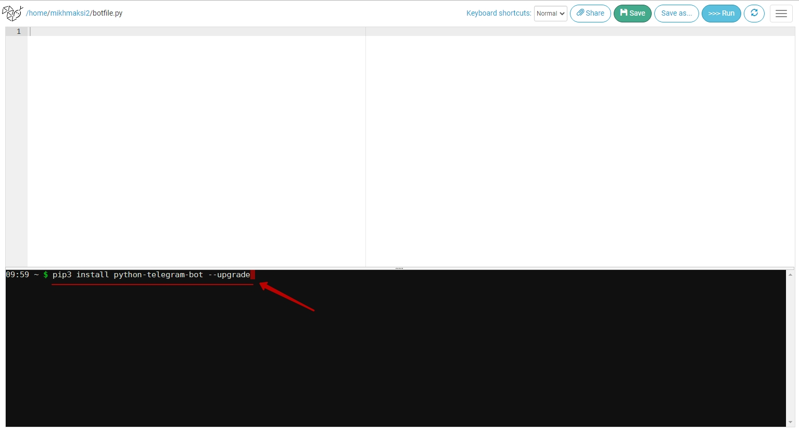
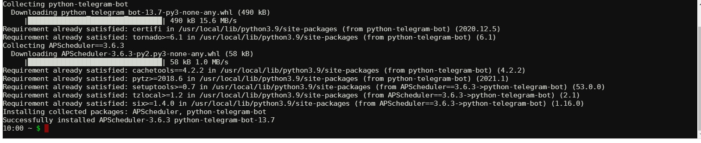

# Создание своего бота.
Все наши упражнения в данном курсе для того, чтобы программировать Telegram-ботов.  Но до того, как программировать Telegram-бота нам нужно его создать!

## Обращение к botfather
Новые боты создаются с помощью "Отца всех ботов": специального бота с именем `botfather`  
Для подключение к боту-создателю в поисковой строке в телеграмме наберите `botfather`  
  

## Команды к botfather
1. Выбираем меню команд.  
2. Выбираем команду `/newbot` (создать нового бота)  
  

## Создание имени нового бота
**1.** После команды `/newbot` `botfather` нас попросит ввести имя бота
**1.** После ввода имение `botfather` попросит ввести пользовательское имя бота (оно должно заканчиваться на `_bot`)
  

**!!! обязательно сохраните код доступа к боту - он нам понадобится!**


## Среда запуска Pythonanywhere
У нас есть бот и мы хорошенько потренировались в Python-тренажере. Теперь нам необходимо место, в котором будет запускаться "ум" нашего бота.
Для этого будем использовать сервис Pythonanywhere - абсолютно бесплатно вы получите возможность запускать своих ботов, при этом боты смогут работать даже тогда, когда ваш личный компьютер будет выключен.

### Создадим рабочее место на сервере [https://www.pythonanywhere.com/](https://www.pythonanywhere.com/).
#### Выберите на главной странице создание кода  
  

#### Выберите пакет "Начинающий"
  

#### Зарегистрируйтесь  
  

#### Пропустите интерактивную инструкцию 
  

#### Перейдите в раздел работы с файлами   
  

#### Создайте новый файл  
**1** - введите имя создаваемого файла (в примере **start.py**)  
**2** - нажмите кнопку **"New file"**
  

#### Запустите первую программу
После создания файла сразу откроется рабочее окно.  
**1** - введите код программы  
```py
s = "Hello, world!"
print(s)
```   
**2** - запустите программу, нажав кнопку **>>>>Run**  
**3** - в нижней части экрана появится блок с черным фоном (консоль), в которой отобразится результат выполнения программы (`V`)

  

# Запуск программы эхо-бота
### На странице учетой записи pythonanywhere.com зайдите в раздел Files
  

### Создайте новый файл
**1** - введите имя создаваемого файла (в примере **botfile.py**)  
**2** - нажмите кнопку **"New file"**
  

### Запустите консоль
В открывшемся окне нажмите кнопку **"Bash console here"**
  

### Установите библиотеку для работы с Teleogram
В открывшееся окне с черным фоном впишите команду установки библиотеки для работы с Telegram.  
`pip3 install python-telegram-bot --upgrade `
  
Будут установлены все необходимые библиотеки:  
  

### Запуск бота в работу.
Вставьте в поле для кода текст программы эхобота:  
```py
from telegram.ext import Updater, MessageHandler, Filters

def echo(update, context):
    string_in = update.message.text
    string_out = string_in
    update.message.reply_text(string_out)

updater = Updater("")

dispatcher = updater.dispatcher

dispatcher.add_handler(MessageHandler(Filters.all, echo))

updater.start_polling()
updater.idle()
```
Для того, чтобы созданный вами бот в "отце всех ботов"  <a href = "https://web.telegram.org/z/#93372553" target = "_blank">специальном боте BotFather</a> начал отвечать нам на все отправляемые сообщения необходимо запустить программу с кодом подключения к нему:

После установки кода подключения код эхобота необходимо запустить.

В результате запуска данной программы созданный вами бот будет повторять за вами все ваши сообщения.  
  
  
  
Обратите внимание на схожесть заданий в автопроверке и структуре программы в боте.  

Они отличаются только командами чтения и вывода: в тренажере это команды чтения и вывода в консоль, а в боте - команды чтения и вывода в бот.  
Такая схожесть структуры позволит вам в течении всего курса опыт и навыки, полученные в тренажере  переносить на развитие создаваемого вами телеграм-бота.  
