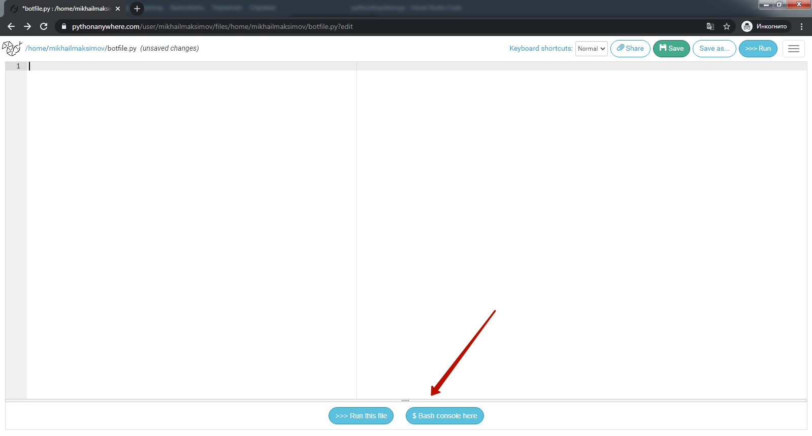

# Створення власного бота.
Усі наші вправи в даному курсі для того, щоб навчитися програмувати Telegram-ботів. Але до того, як програмувати Telegram-бот нам потрібно його створити!

## Звернення до botfather  
Нові боти створюються за допомогою Батька всіх ботів: спеціального бота з ім'ям `botfather`  
Для підключення до бота-творця в пошуковому рядку в телеграмі наберіть 'botfather'  
  

## Команди до botfather
1. Вибираємо меню команд.  
2. Вибираємо команду `/newbot` (створити нового бота)  


## Створення імені нового бота
**1.** Після команди `/newbot` `botfather` нас попросить ввести ім'я бота  
**1.** Після введення назви `botfather` попросить ввести ім'я бота (воно має закінчуватися на `_bot`)  

  
**! обов'язково збережіть код доступу до бота - він нам знадобиться в майбутньому!**

## Середа запуску Pythonanywhere
У нас є бот і ми добре потренувалися в Python-тренажері. Тепер нам потрібне місце, в якому запускатиметься "розум" нашого бота.
Для цього будемо використовувати сервіс Pythonanywhere – абсолютно безкоштовно ви отримаєте можливість запускати своїх ботів, при цьому боти зможуть працювати навіть тоді, коли ваш особистий комп'ютер буде вимкнений.


### Створимо робоче місце на сервері [https://www.pythonanywhere.com/](https://www.pythonanywhere.com/).
#### Виберіть на головній сторінці створення коду


#### Виберіть пакет "Початківець"


#### Зареєструйтесь


#### Пропустіть інтерактивну інструкцію


#### Перейдіть до розділу роботи з файлами


#### Створіть новий файл
**1** - введіть ім'я файлу, що створюється (у прикладі **start.py**)
**2** - натисніть кнопку **"New file"**


#### Запустіть першу програму  
Після створення файлу одразу відкриється робоче вікно.  
**1** - введіть код програми  
```py
s = "Hello, world!"
print(s)
```  
**2** - запустіть програму, натиснувши кнопку **>>>>Run**  
**3** - у нижній частині екрана з'явиться блок із чорним фоном (консоль), у якому відобразиться результат виконання програми (`V`)  
  


# Запуск програми ехо-бота
### На сторінці облікового запису pythonanywhere.com зайдіть в розділ Files


### Створіть новий файл
**1** - введіть ім'я файлу, що створюється (у прикладі **botfile.py**)
**2** - натисніть кнопку **"New file"**


### Запустіть консоль
У вікні, натисніть кнопку **"Bash console here"**


### Встановіть бібліотеку для роботи з Teleogram
У вікні з чорним фоном впишіть команду установки бібліотеки для роботи з Telegram.  
  
`pip3 install python-telegram-bot --upgrade`  
   


Будуть встановлені всі необхідні бібліотеки:


### Запуск робота в роботу.
Вставте в поле для коду текст програми ехобота:  

```py
from telegram.ext import Application, MessageHandler, filters

async def echo(update, context):
    string_in = update.message.text
    string_out = string_in
    await update.message.reply_text(string_out)

application = Application.builder().token("").build()

application.add_handler(MessageHandler(filters.TEXT, echo))

application.run_polling()
```

Для того, щоб створений вами бот у "батьку всіх ботів" <a href = "https://web.telegram.org/z/#93372553" target = "_blank">спеціальному боті BotFather</a> почав відповідати нам на всі повідомлення, що вводить користувач, необхідно запустити програму з кодом підключення до нього:

Після встановлення коду підключення код ехобота необхідно запустити.

В результаті запуску даної програми створений вами бот повторюватиме за вами всі ваші повідомлення.  
  
  
Зверніть увагу на схожість завдань в автоперевірці та структурі програми в роботі.

Вони відрізняються лише командами читання та виведення: у тренажері це команди читання та виведення в консоль, а в боті – команди читання та виведення в бот.
Така схожість структури дозволить вам протягом усього курсу досвід і навички, отримані в тренажері переносити на розвиток телеграм-бота, що створюється вами.

### Повторний запуск
Якщо вам необхідно запустити бота повторно необхідно зупити попередній процес. Для цього необхідно зайти до переліку запущених процесів (консолей).  
Для цього необхідно перейти на головну сторінку.
  
Бажано відкрити в новій сторінці.  
  
Далі перейти в розділ "Консолі"  
  
Та закрити відповідний процес  
  
На сторінці, на якій розміщено бот буде написано, що консоль закрита.  
  

