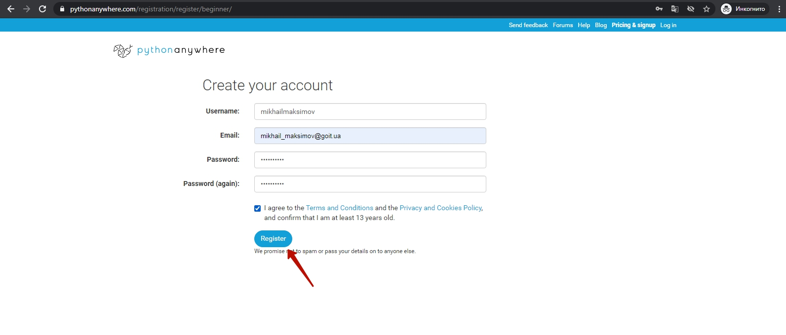

## Среда запуска Pythonanywhere
У нас есть бот и мы хорошенько потренировались в Python-тренажере. Теперь нам необходимо место, в котором будет запускаться "ум" нашего бота.
Для этого будем использовать сервис Pythonanywhere - абсолютно бесплатно вы получите возможность запускать своих ботов, при этом боты смогут работать даже тогда, когда ваш личный компьютер будет выключен.

### Создадим рабочее место на сервере [https://www.pythonanywhere.com/](https://www.pythonanywhere.com/).
#### Выберите на главной странице создание кода  
  

#### Выберите пакет "Начинающий"
  

#### Зарегистрируйтесь  
  

#### Пропустите интерактивную инструкцию 
  

#### Перейдите в раздел работы с файлами   
  

#### Создайте новый файл  
**1** - введите имя создаваемого файла (в примере **start.py**)  
**2** - нажмите кнопку **"New file"**
  

#### Запустите первую программу
После создания файла сразу откроется рабочее окно.  
**1** - введите код программы  
```py
s = "Hello, world!"
print(s)
```   
**2** - запустите программу, нажав кнопку **>>>>Run**  
**3** - в нижней части экрана появится блок с черным фоном (консоль), в которой отобразится результат выполнения программы (`V`)

  