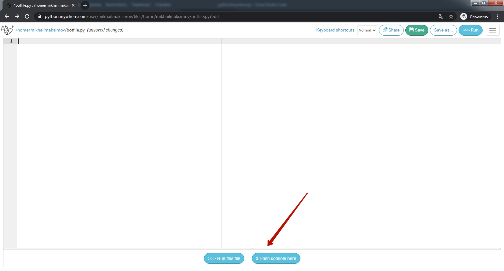
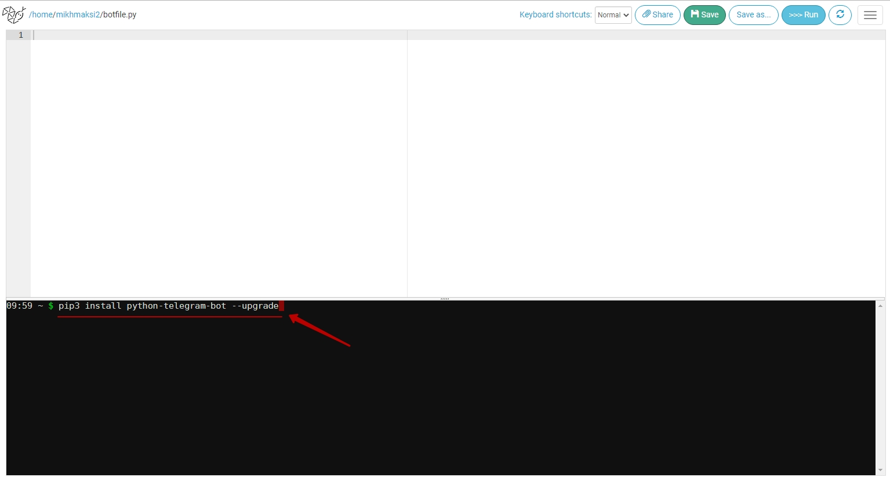
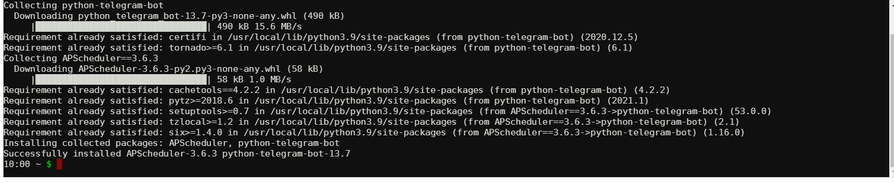
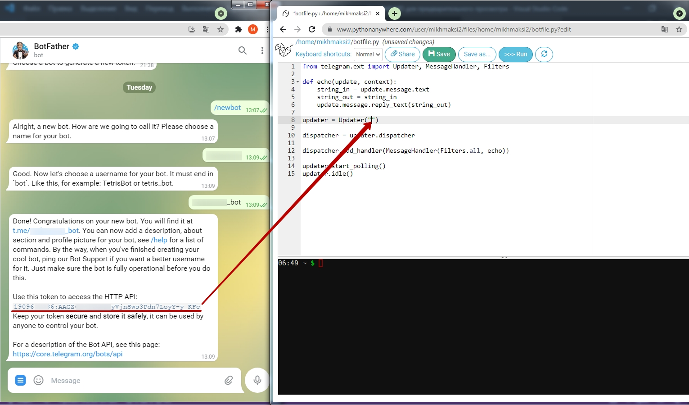
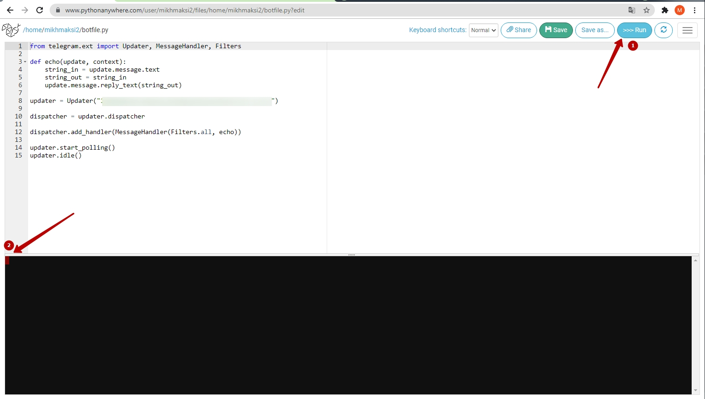
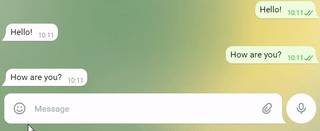
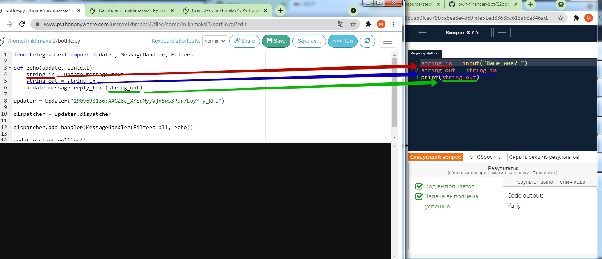

# Запуск программы эхо-бота
### На странице учетой записи pythonanywhere.com зайдите в раздел Files
  

### Создайте новый файл
**1** - введите имя создаваемого файла (в примере **botfile.py**)  
**2** - нажмите кнопку **"New file"**
  

### Запустите консоль
В открывшемся окне нажмите кнопку **"Bash console here"**
  

### Установите библиотеку для работы с Teleogram
В открывшееся окне с черным фоном впишите команду установки библиотеки для работы с Telegram.  
`pip3 install python-telegram-bot --upgrade `
  
Будут установлены все необходимые библиотеки:  
  

### Запуск бота в работу.
Вставьте в поле для кода текст программы эхобота:  
```py
from telegram.ext import Updater, MessageHandler, Filters

def echo(update, context):
    string_in = update.message.text
    string_out = string_in
    update.message.reply_text(string_out)

updater = Updater("")

dispatcher = updater.dispatcher

dispatcher.add_handler(MessageHandler(Filters.all, echo))

updater.start_polling()
updater.idle()
```
Для того, чтобы созданный вами бот в "отце всех ботов"  <a href = "https://web.telegram.org/z/#93372553" target = "_blank">специальном боте BotFather</a> начал отвечать нам на все отправляемые сообщения необходимо запустить программу с кодом подключения к нему:

После установки кода подключения код эхобота необходимо запустить.

В результате запуска данной программы созданный вами бот будет повторять за вами все ваши сообщения.  
  
  
  
Обратите внимание на схожесть заданий в автопроверке и структуре программы в боте.  

Они отличаются только командами чтения и вывода: в тренажере это команды чтения и вывода в консоль, а в боте - команды чтения и вывода в бот.  
Такая схожесть структуры позволит вам в течении всего курса опыт и навыки, полученные в тренажере  переносить на развитие создаваемого вами телеграм-бота.  