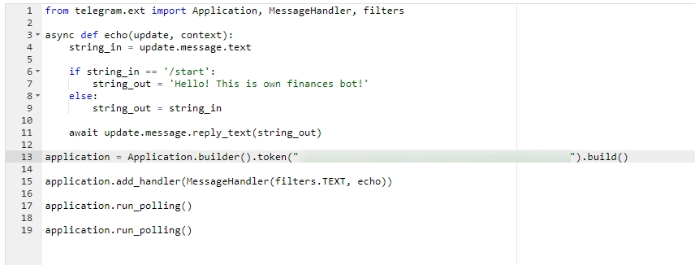
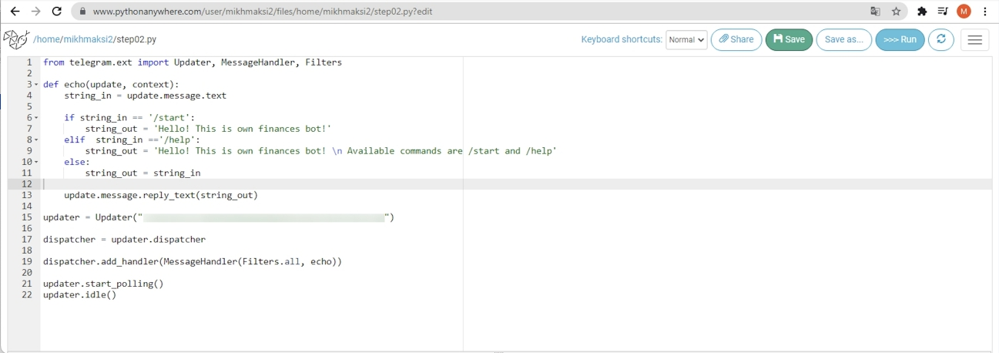

# Команды в Телеграм-боте
В этот учебный день мы с вами научим бота реагировать на команды.  
В тренажере мы уже написали программы, которые обрабатывают команду `/start`, которая выполняется всеми подписчиками бота в момент подписки и команду `/help` в ответ на которую всегда отправляется информация о боте со всеми возможными командами.  
В этом задании мы рассмотрим как запустить телеграм-бота с соответствующим функционалом.
## Команда /start
Если смотреть по сути, то команда `/start` - это просто соответствующая строка. При этом мы уже научились читать строки - мы все получаемые значения отправляем в переменную `start_in`.
Соответственно решением данной задачи будет то, что мы проверяем строку, которую вводит пользователь. Если она равна `/start`, то мы отправляем пользователю приветственное сообщение. Во всех других случаях - отпраляем то же сообщение, которое отправляет пользователь.
```py
from telegram.ext import Updater, MessageHandler, Filters

def echo(update, context):
    string_in = update.message.text

    if string_in == '/start':
        string_out = 'Hello! This is own finances bot!'
    else:
        string_out = string_in

    update.message.reply_text(string_out)

updater = Updater("")

dispatcher = updater.dispatcher

dispatcher.add_handler(MessageHandler(Filters.all, echo))

updater.start_polling()
updater.idle()
```

В возвращаемой строке при вводе команды `/start` может возвращаться любое значение. Вы можете корректировать его самостоятельно.
  
В сервисе **Pythonanywhere** данное выполненое данное задание будет выглядеть следующим образом:
  

На 14-й строчке примера необходимо указать код подключения к боту, который необходимо взять из специального бота `botfather`. 

## Команда /help
По общепринятому правилу если пользователь вводит команду `/help`, то бот ему возвращает список команд, которые он воспринимает, а также обычно содержит краткое описание бота.  
Добавим к отправке информации при получении команды `/start` реакцию на команду `/help`
```py
from telegram.ext import Updater, MessageHandler, Filters

def echo(update, context):
    string_in = update.message.text

    if string_in == '/help':
        string_out = 'Hello! This is own finances bot! \n Аvailable commands are /start and /help'
    else:
        string_out = string_in

    update.message.reply_text(string_out)

updater = Updater("")

dispatcher = updater.dispatcher

dispatcher.add_handler(MessageHandler(Filters.all, echo))

updater.start_polling()
updater.idle()


```
## Команды /help и /start
Для того, чтобы объединить функционал команд и бот мог одновременно обрабатывать команды `/help` и `/start` воспользуемся оператором `elif`. Данный оператор используется внутри основного оператора выбора `if` и позволяет добавлять ветвь решения. Например, если входная строка `string_in` не равна `/start`, то мы не сразу возвращаем входную строку (присваиваем переменной `string_in` значение `string_out`), а проверяем не равна ли входная строка значению `/help`. Если равна - выводим сообщение-ответ подготовленный для команды `/help`. И только если при второй проверке мы получаем результат `False` - тогда возвращаем входное значение.

```py
from telegram.ext import Updater, MessageHandler, Filters

def echo(update, context):
    string_in = update.message.text

    if string_in == '/start':
        string_out = 'Hello! This is own finances bot!'
    elif  string_in =='/help':
        string_out = 'Hello! This is own finances bot! \n Аvailable commands are /start and /help'
    else:
        string_out = string_in


    update.message.reply_text(string_out)

updater = Updater("")

dispatcher = updater.dispatcher

dispatcher.add_handler(MessageHandler(Filters.all, echo))

updater.start_polling()
updater.idle()

```
<div class="attention">
<h5>Обратите внимание</h5>
<p>Используется конструкция `ielf` - она позволяет добавить условие выполнени в операторе выбора.</p>
</div>


В сервисе **Pythonanywhere** данное выполненое данное задание будет выглядеть следующим образом:
  

На 14-й строчке примера необходимо указать код подключения к боту, который необходимо взять из специального бота `botfather`. 

## Реализация двух команд в тренажере
```py
string_in = input('input command')
if string_in == '/start':
    string_out = 'Hello! This is own finances bot!'
elif  string_in =='/help':
    string_out = 'Hello! This is own finances bot! \n Аvailable commands are /start and /help'
else:
    string_out = string_in
```

Как видите - все строки в тренажере (начиная со втрой) соответствуют строкам в боте (строки с 6 по 11).


## Дополнительное задание
* Создайте минимум 3 команды для бота и "научите" бота отправлять в ответ на такие команды инфорционные сообщения. Например: `/savings` - информация о том, как эффективно создавать сбережения, `/income` - информация о том, как постоянно увеличивать доходы, `/investment` - информация о том, как инвестировать накопленные средства.