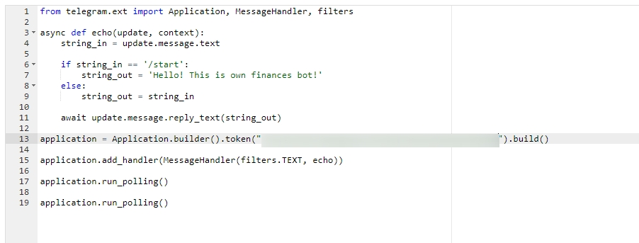

# Команди у Телеграм-боті
У цей навчальний день ми з вами навчимо робота реагувати на команди.
У тренажері ми вже написали програми, які обробляють команду `/start`, яка виконується всіма підписниками бота в момент підписки та команду `/help` у відповідь на яку завжди надсилається інформація про бот з усіма можливими командами.
У цьому завданні ми розглянемо, як запустити телеграм-бота з відповідним функціоналом.
## Команда /start
Якщо дивитися по суті, то команда `/start` - це відповідний рядок. При цьому ми вже навчилися читати рядки - ми всі значення, що отримуються, відправляємо в змінну `string_in`.
Відповідно рішенням цієї задачі буде те, що ми перевіряємо рядок, який вводить користувач. Якщо вона дорівнює `/start`, ми надсилаємо користувачеві вітальне повідомлення. У всіх інших випадках - відправляємо те повідомлення, яке відправляє користувач.
```py
from telegram.ext import Updater, MessageHandler, Filters

def echo(update, context):
    string_in = update.message.text

    if string_in == '/start':
        string_out = 'Hello! This is own finances bot!'
    else:
        string_out = string_in

    update.message.reply_text(string_out)

updater = Updater("")

dispatcher = updater.dispatcher

dispatcher.add_handler(MessageHandler(Filters.all, echo))

updater.start_polling()
updater.idle()
```

У рядку, що повертається, при введенні команди `/start` може повертатися будь-яке значення. Ви можете коригувати його самостійно.
  
У сервісі **Pythonanywhere** дане виконане завдання буде виглядати так:

  

На 14-му рядку прикладу необхідно вказати код підключення до бота, який необхідно взяти зі спеціального бота `botfather`.

## Команда /help
За загальноприйнятим правилом якщо користувач вводить команду `/help`, то бот йому повертає перелік команд, які він сприймає, а також містить короткий опис бота.
Додамо до відправки інформації при отриманні команди `/start` реакцію на команду `/help`

```py
from telegram.ext import Updater, MessageHandler, Filters

def echo(update, context):
    string_in = update.message.text

    if string_in == '/help':
        string_out = 'Hello! This is own finances bot! \n Аvailable commands are /start and /help'
    else:
        string_out = string_in

    update.message.reply_text(string_out)

updater = Updater("")

dispatcher = updater.dispatcher

dispatcher.add_handler(MessageHandler(Filters.all, echo))

updater.start_polling()
updater.idle()


```
## Команды /help и /start
Для того, чтобы объединить функционал команд и бот мог одновременно обрабатывать команды `/help` и `/start` воспользуемся оператором `elif`. Данный оператор используется внутри основного оператора выбора `if` и позволяет добавлять ветвь решения. Например, если входная строка `string_in` не равна `/start`, то мы не сразу возвращаем входную строку (присваиваем переменной `string_in` значение `string_out`), а проверяем не равна ли входная строка значению `/help`. Если равна - выводим сообщение-ответ подготовленный для команды `/help`. И только если при второй проверке мы получаем результат `False` - тогда возвращаем входное значение.

```py
from telegram.ext import Updater, MessageHandler, Filters

def echo(update, context):
    string_in = update.message.text

    if string_in == '/start':
        string_out = 'Hello! This is own finances bot!'
    elif  string_in =='/help':
        string_out = 'Hello! This is own finances bot! \n Аvailable commands are /start and /help'
    else:
        string_out = string_in


    update.message.reply_text(string_out)

updater = Updater("")

dispatcher = updater.dispatcher

dispatcher.add_handler(MessageHandler(Filters.all, echo))

updater.start_polling()
updater.idle()

```

<div class="attention">
<h5>Зверніть увагу</h5>
<p>Використовується конструкція `elif` - вона дозволяє додати умову виконання в операторі вибору.</p>
</div>
  
  
У сервісі **Pythonanywhere** дане виконане завдання буде виглядати так:  

  

На 14-му рядку прикладу необхідно вказати код підключення до бота, який необхідно взяти зі спеціального бота `botfather`.

## Реалізація двох команд у тренажері
```py
string_in = input('input command')
if string_in == '/start':
    string_out = 'Hello! This is own finances bot!'
elif  string_in =='/help':
    string_out = 'Hello! This is own finances bot! \n Аvailable commands are /start and /help'
else:
    string_out = string_in
```

Як бачите - всі рядки в тренажері (починаючи з другої) відповідають рядкам у боті (рядки з 6 по 11).


## Додаткове завдання
* Створіть мінімум 3 команди для бота і "навчіть" бот відправляти у відповідь на команди інформаційні повідомлення.  
Наприклад: `/savings` - інформація про те, як ефективно створювати заощадження, `/income` - інформація про те, як постійно збільшувати доходи, `/investment` - інформація про те, як інвестувати накопичені кошти.