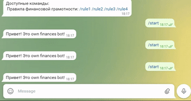

# Інформативні команди.

Попередніми днями ми вже навчили бота реагувати на команди '/start' і '/help'. Ці дві команди мають специфічне призначення для ботів: "/start" завжди виконується при початку роботи з ботом, а "/help" виводить інформацію про всі існуючі команди, доступні при роботі з ботом.
Але так само можна використовувати будь-які інші команди. В результаті - ви зможете створити з бота довідкову систему або матеріал для підготовки до іспитів, заліків та контрольних: команди будуть містити номер питання, наприклад `/task1`, `/task2`, `/task3`, ... а повідомленнями, що надсилаються у відповідь на такі запити буде матеріал по темі.
### Фінансові правила в боті
Тематикою створюваного нами бота є особисті фінанси. І ми пропонуємо розширити функціонал створюваного робота підказками за основними правилами фінансової грамотності (взяті з сайту [businessviews.com.ua](https://businessviews.com.ua/ru/business/id/pravila-finansovoj-gramotnosti-2372/)):  

**1. Рахуй дрібні витрати**
Невеликі витрати, які ти зазвичай не враховуєш, у результаті переростають у чималу суму. Сьогодні 40 гривень на каву, завтра несподіваний хот-дог.

**2. Став довгострокові фінансові цілі** Наприклад, ти хочеш відкласти гроші на ноутбук або на відпустку — це і є ціль. Цілі потрібно знати, щоб тримати їх в умі та розуміти, заради чого ти сьогодні не витратиш 40 гривень на каву. Це психологія – відмовлятися від якихось витрат простіше, якщо ти знаєш, заради чого це робиш.


**3. Прокачуйте свої професійні навички** Щоб заробляти більше.

  
**4. Живи як інвестор** Приймаючи рішення, оцінюй їх так, як інвестор оцінює бізнес, який має намір інвестувати. Задавай собі запитання: а що я з цього матиму? Який результат я отримаю і коли? Як я зможу отримати ще кращий результат? Це вправа, яка допомагає прокачати особисту продуктивність, звільнити час від непотрібних занять і наповнити його корисними — і з погляду фінансів, і моральної задоволеності від результату.

```py
from telegram.ext import Updater, MessageHandler, Filters

def echo(update, context):
    string_in = update.message.text

if string_in == '/start':
        string_out = 'Привіт! Це own finances bot!'
    elif string_in == '/rule1':
        string_out = '1. Рахуй дрібні витрати \n Невеликі витрати, які ти зазвичай не враховуєш, у результаті переростають у пристойну суму. Сьогодні 40 гривень на каву, завтра несподіваний хот-дог. '
    elif string_in == '/rule2':
        string_out = '2. Став довгострокові фінансові цілі Наприклад, ти хочеш відкласти гроші на ноут або на відпустку — це і є мета. Цілі потрібно знати, щоб тримати їх в умі та розуміти, заради чого ти сьогодні не витратиш 40 гривень на каву. Це психологія – відмовлятися від якихось витрат простіше, якщо ти знаєш, заради чого це робиш. '
    elif string_in == '/rule3':
        string_out = '3. Прокачуйте свої професійні навички \n Щоб заробляти більше. '
    elif string_in == '/rule4':
        string_out = '4. Живи як інвестор Приймаючи рішення, оцінюй їх так, як інвестор оцінює бізнес, у який має намір інвестувати. Задавай собі запитання: а що я з цього матиму? Який результат я отримаю і коли? Як я зможу отримати ще найкращий результат? Ця вправа, яка допомагає прокачати особисту продуктивність, звільнити час від непотрібних занять і наповнити його корисними — і з погляду фінансів, і моральної задоволеності від результату. '    
    else:
        string_out = string_in


    update.message.reply_text(string_out)

updater = Updater("")

dispatcher = updater.dispatcher

dispatcher.add_handler(MessageHandler(Filters.all, echo))

updater.start_polling()
updater.idle()


```

